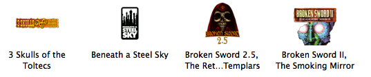
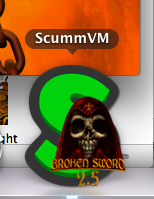
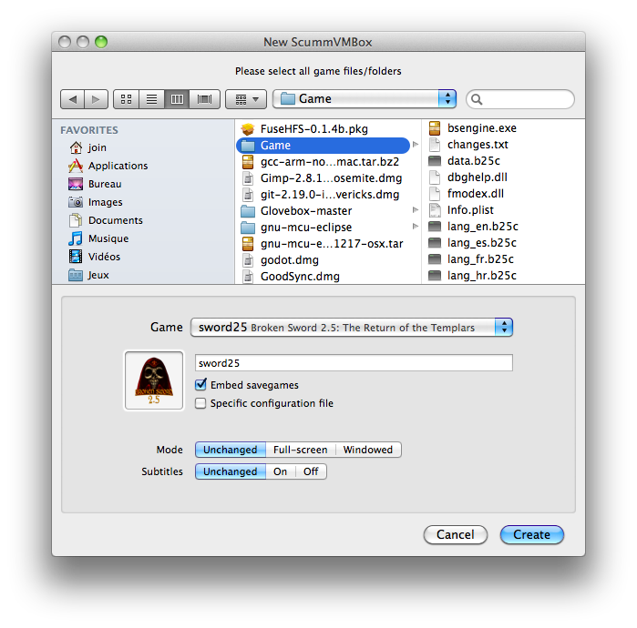

# scummvmbox

ScummVMBox is a bundler for your ScummVM games on macOS (10.9+).
It allows you to create game bundles that you can double-click to directly launch the game.




## How to use

 - Download and install the _ScummVMBox_ app anywhere you like (`/Applications` is a good choice).
 - Launch the _ScummVMBox_ app.
 - Select the _File > New Box From Folder…_ menu item.
 - Point it to the folder containing your game files, or select them directly.
 - Find the game's name in the list; if available, an icon will be downloaded from the [official repository](https://github.com/scummvm/scummvm-icons).
 - You can set up a few options (you might need to click _Options_ to see them), such as:
   - whether to embed the savegames into the folder,
   - create a specific configuration file to use, 
   - force Full-screen Mode or subtitles,
   - set a custom icon that will also appear on the Dock when you launch the game.
 - Click _Create_. A bundle is then created for your game, and it is revealed in the Finder.



## Creating game bundles manually

You can also create game bundles manually (or using another utility), and _ScummVMBox_ will just launch them for you.

 - Create a folder with the contents of the game.
 - Inside this folder, create an _Info.plist_ file, and add the following items (using the [appropriate format](https://en.wikipedia.org/wiki/Property_list)) :
   - `GameID` (_String_, mandatory): the identifier of the game in ScummVM (you can find it from the [compatibility list](https://www.scummvm.org/compatibility), from [this list](https://github.com/scummvm/scummvm-icons/blob/master/default/games.xml), or elsewhere)
   - `Fullscreen` (_Boolean_, optional): whether to force full-screen mode (`true`) or windowed mode (`false`); if this key is absent, ScummVM will follow your global settings
   - `Subtitles` (_Boolean_, optional): whether to force subtitles (`true`) or no subtitles (`false`); if this key is absent, ScummVM will follow your global settings
 - If you create a folder named `ScummVM Savegames`, then ScummVM will use it to store its savegames; else it will follow your global settings
 - If you want an icon to appear on the dock, then create a `ScummVM Extra` folder, and put your icon inside, named `<gameid>.png` (replace `<gameid>` with the identifier of the game in ScummVM)
 - Finally, rename your game folder so as its extension is `.scummvmbox`. This will automatically turn it into a game bundle that you can double-click.

## How to build from source

```bash
make
```

The application will be generated in `build/ScummVMBox.app`.

You can also use the following Make targets:

 - `make run` to compile and launch the application
 - `make debug` to compile and debug a separate debug build
 - `make clean` to remove the build folder

## Acknowledgements

This project uses parts from [KSFileUtilities](https://github.com/karelia/KSFileUtilities).

Thanks to:
 - [Boxer](https://github.com/alunbestor/Boxer) for the game bundle idea
 - The [ScummVM contributors](https://www.scummvm.org/credits/)
